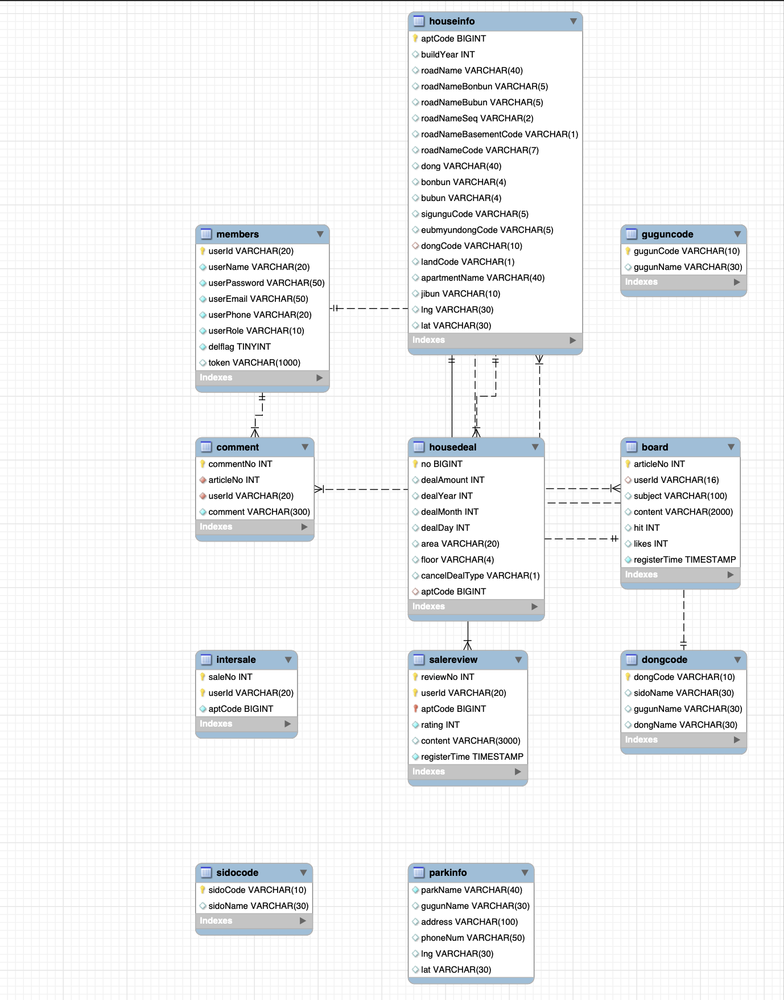
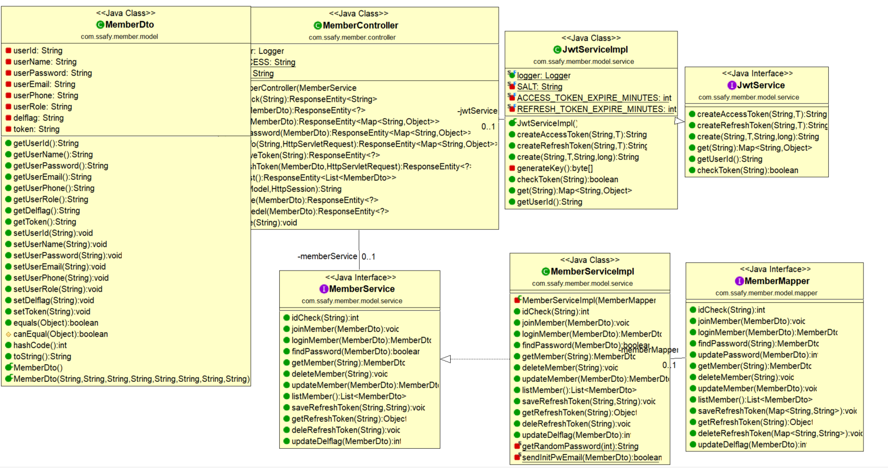
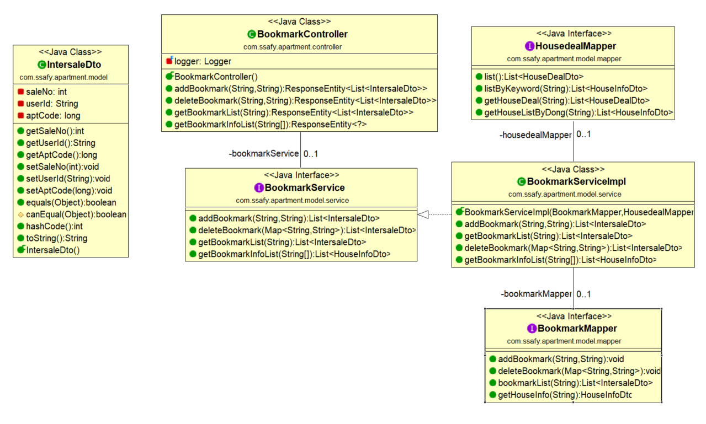
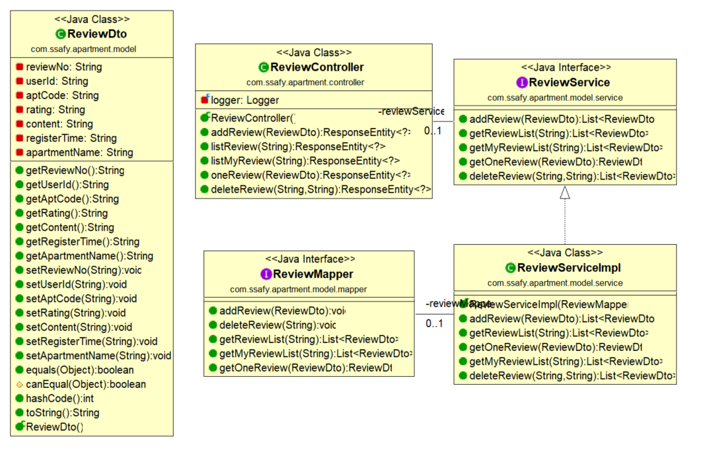
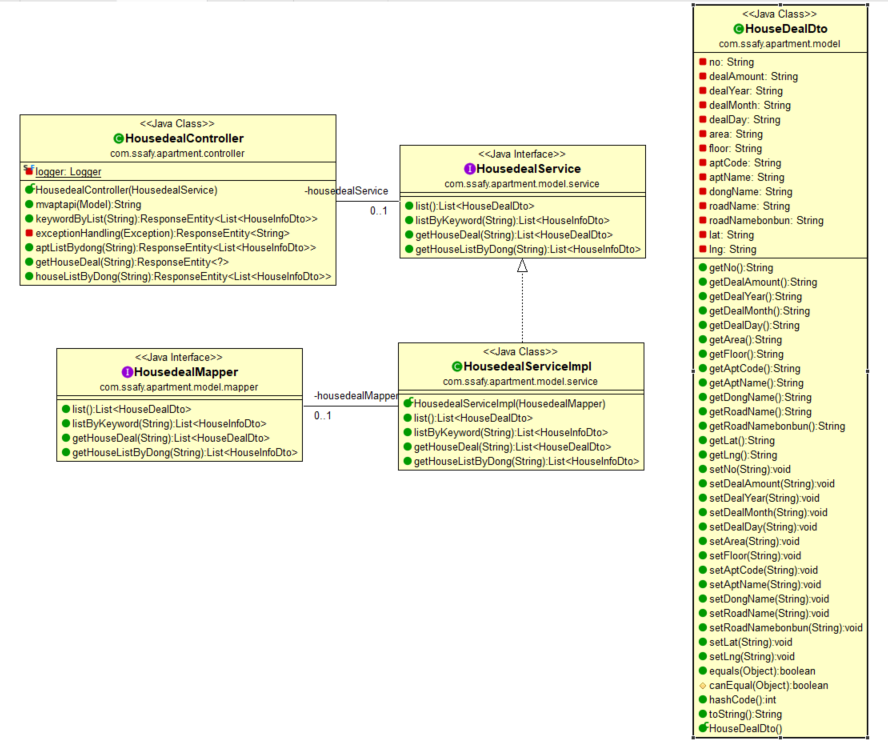
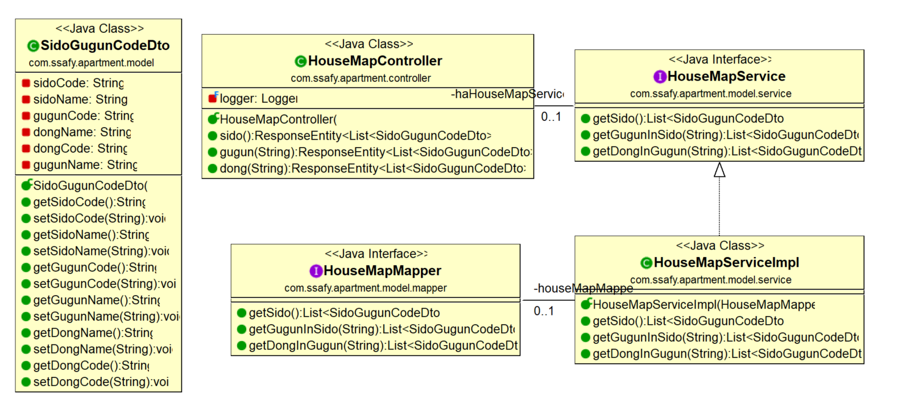
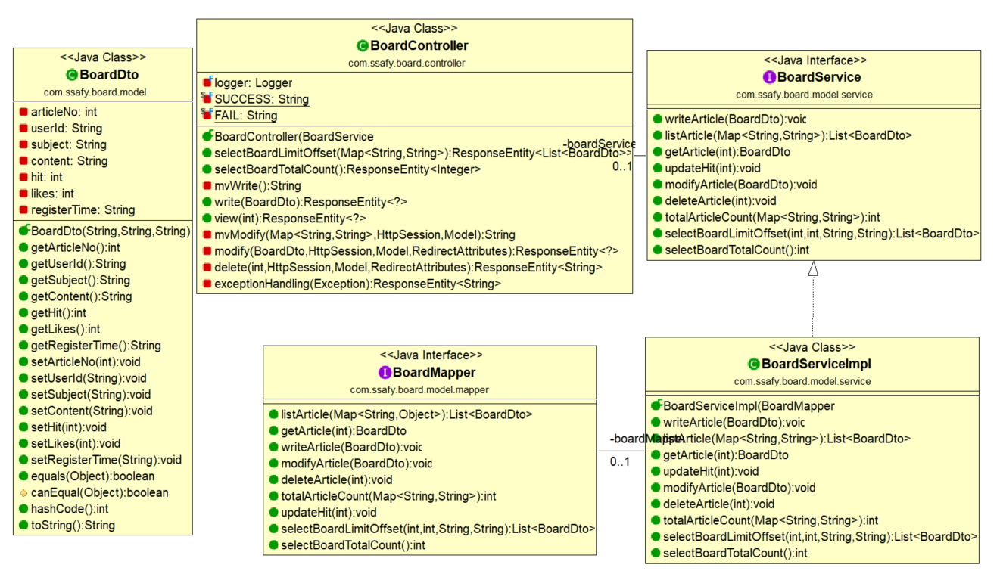
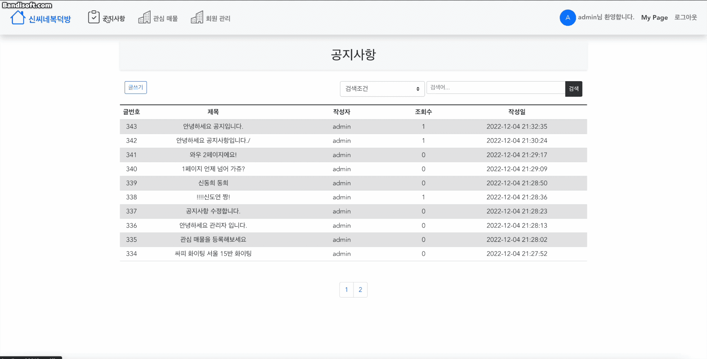
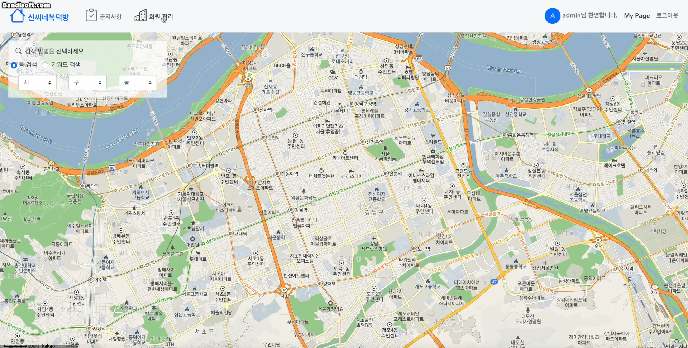
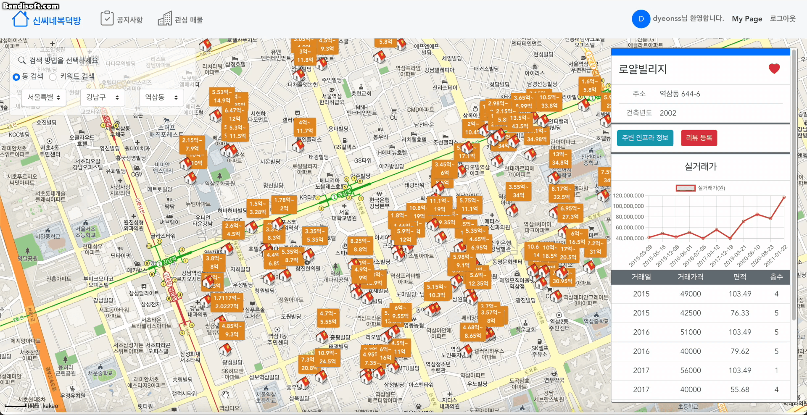

# 신씨네복덕방 프로젝트

🐱 본 프로젝트는 **삼성 청년 SW아카데미** 1학기 파이널 프로젝트입니다.

## 개요

---

- 부동산 매물의 실거래가 등 다양한 서비스 제공을 목적으로 리뷰, 북마크, 매물정보 그래프 추이 등 정보 제공.

## 프로젝트 기간

---

- 2022년 11월 16일 ~ 2022년 11월 24일

## 기술 스택

---

   
   
   
   
   
   
   
  

## 팀원

---

<table>
  <thead>
    <tr>
      <th>이름</th>
      <th>역할</th>
      <th>구현 기능</th>
    </tr>
  </thead>
  <tbody>
    <tr>
      <td rowspan="2">신도연</td>
      <td rowspan="2">팀장</td>
      <td>추후 추가</td>
    </tr>
    <tr>
      <td>추후 추가</td>
    </tr>
    <tr>
      <td rowspan="2">신동희</td>
      <td rowspan="2">팀원</td>
      <td>Back-End (북마크, 리뷰, 실거래가 등 REST API 설계) </td>
    </tr>
    <tr>
      <td>Front-End (카카오맵 API 레이아웃 전반, 부동산 상세보기, 리뷰, 북마크, 마이페이지, 카카오 REST API)</td>
    </tr>
  </tbody>
</table>

## DataBase 설계

---

## UML 다이어그램

---

✅**Member UML**

✅**Bookmark UML**

✅**Review UML**

✅**Deal UML**

✅**Map UML**

✅**Board UML**

## 주요기능

---

| Depth1          | Depth2   | 내용                                                    |
| --------------- | -------- | ------------------------------------------------------- |
| 로그인/회원관리 | 회원가입 | - 아이디, 비밀번호, 이름, 이메일 주소, 핸드폰 번호   - 입력 아이디 입력 시 6자 이상 16자 이하 여부 및 중복 비동기 확인   - 비밀번호와 비밀번호 확인을 비교하여 일치 여부 확인   - 가입 클릭 시 로그인 페이지로 이동 |
| 로그인/회원관리 | 로그인 | - 아이디, 비밀번호 입력  - 아이디와 비밀번호 입력시 JWT토큰으로 access토큰과 refresh토큰 발급  - 로그인 완료 시 메인 페이지로 이동 |
| 로그인/회원관리 | 비밀번호 찾기 | - 가입된 아이디와 이메일 주소 입력  - 아이디와 이메일 주소 일치 시 가입시 기재된 이메일로 임시 비밀번호 발송  - 임시 비밀번호는 랜덤 12자 문자열 |
| 로그인/회원관리 | 로그아웃 | - 로그아웃시 DB에서 토큰 정보 삭제 |
| 마이 페이지 | 회원 정보 수정 | - 아이디 변경 불가  - 비밀번호 입력시 회원 정보 수정 가능  - 수정 완료 시 마이페이지로 이동 |
| 마이 페이지 | 회원 탈퇴 | - 회원 정보의 비밀번호를 입력 후 일치 시 회원 탈퇴  - 탈퇴 시 db데이터는 삭제되지 않으며 delflag의 작동으로 추후 복구 가능  - 탈퇴 시 메인 페이지로 이동 |
| 마이 페이지 | 내 리뷰 확인 | - 화면에서 내가 리뷰를 한 것을 확인 가능  - 화면에서 삭제버튼으로 내가 작성한 리뷰 삭제 가능 |
| 실거래가 조회 | 검색 | - 조회하는 데이터는 대한민국 전체 데이터  - 조회할 건물들은 지역 검색, 또는 키워드 검색이 가능하다.  - 동 검색: 한국 지역의 시, 구군, 동 으로 나뉘어서 콤보박스에 표시되며, 동까지 선택하면 그 조건에 맞는 건물들이 지도에 표시  - 키워드 검색: 아파트 이름 또는 동이름을 키워드로 검색할 수 있으며 검색 결과는 둘다 지도에 표시된다.  - 검색된 데이터는 다음과 같이 표시된다.  - 건물들을 클러스터로 가까운 거리들을 개수로 표시  - 건물들을 지도 상에 오버레이로 각 건물들의 실거래가 기준 최소~최대값 표시  - 화면 우측에 건물정보, 리뷰, 실거래가 정보, 실거래가 차트 표시 |
| 실거래가 조회 | 북마크 추가/제거 | - 건물 이름 우측의 하트 버튼을 누르면 북마크 추가된다.  - 북마크가 이미 추가된 건물은 채워진 하트로, 그렇지 않은 건물은 회색 하트 버튼으로 표시된다.  - 버튼을 토글(추가/제거)할 수 있다. |
| 실거래가 조회 | 리뷰 조회/등록 | - 다른 사용자들이 남긴 리뷰를 볼 수 있다.  - 리뷰 등록 버튼으로 리뷰를 등록할 수 있는 모달창이 나온며 여기에서 별점을 클릭과 리뷰 내용작성으로 등록할 수 있다. |
| 실거래가 조회 | 실거래가 리스트/차트 | - 상세보기 컴포넌트에선 최근 10건의 데이터를 리스트로 조회 가능  - 전체 실거래가 데이터는 관심 매물 탭에서 확인 가능  - 전체 데이터에 대한 꺾은선 차트로 추이 확인 가능 및 마우스로 차트 호버시 각각의 일자와 거래가격을 조회 가능 |
| 관심 매물 | 북마크 리스트 | - 자신이 북마크 해놓은 건물들을 가로 스크롤의 카드 형태로 조회 가능  - 각각의 카드 클릭시 전체 실거래가 조회 가능 및 그 데이터의 차트 조회  - 역시 카드마다 하트버튼 토글이 있으며 이 토글버튼 누를 시 북마크 목록에서 제거 됨 |
| 공지사항 | 공지사항 리스트 | - 게시글 번호, 제목, 작성자 등 정보가 리스트로 나오며, 한페이지에 10개의 데이터를 출력  - 게시글 제목을 클릭하여 해당 게시물을 조회할 수 있다. |
| 공지사항 | 공지사항 등록 | - 일반 회원이 아닌 관리자만 등록할 수 있다.  - 게시글의 제목, 내용을 입력받는다.  - 등록 완료 시 공지사항 리스트 페이지로 이동한다. |
| 공지사항 | 공지사항 수정 | - 일반 회원이 아닌 관리자만 수정할 수 있다.  - 게시글의 제목과 내용을 수정할 수 있다.  - 수정 완료 시 수정한 게시글의 디테일 페이지로 이동한다. |
| 공지사항 | 공지사항 삭제 | - 일반 회원이 아닌 관리자만 삭제할 수 있다.  - 게시글을 삭제 버튼을 누를 시 삭제  - 삭제 완료 시 공지사항 리스트로 이동 |
| 회원관리 | 일반회원 리스트 | - 일반 회원이 아닌 관리자만 들어갈 수 있는 탭  - 관리자가 아닌 일반회원에 대한 정보를 리스트로 조회 가능 |
| 회원관리 | 일반회원 삭제/복구 | - 일반 회원이 아닌 관리자만 할 수 있다.  - 기존의 일반 회원을 콤보 박스로 삭제/ 복구 처리를 할 수 있다.  - 삭제된 회원은 로그인을 할 수 없고 반대로 복구된 회원은 그 회원정보로 로그인이 가능하다. |

## 실행 화면

---

**✅ 회원가입**

**✅ 비밀번호 찾기 및 로그인**

**✅ 회원정보 수정 및 확인**

**✅ 회원탈퇴**

**✅ 관리자 로그인 시 헤더 변경**

**✅ 공지사항 등록 및 키워드 검색**

**✅ 관리자 회원 관리**

**✅ 동 검색**

**✅ 키워드 검색**

**✅ 관심매물 등록**

**✅ 관심매물 조회 및 삭제**

**✅ 리뷰 등록 및 관리**

**✅ 리뷰 조회**

